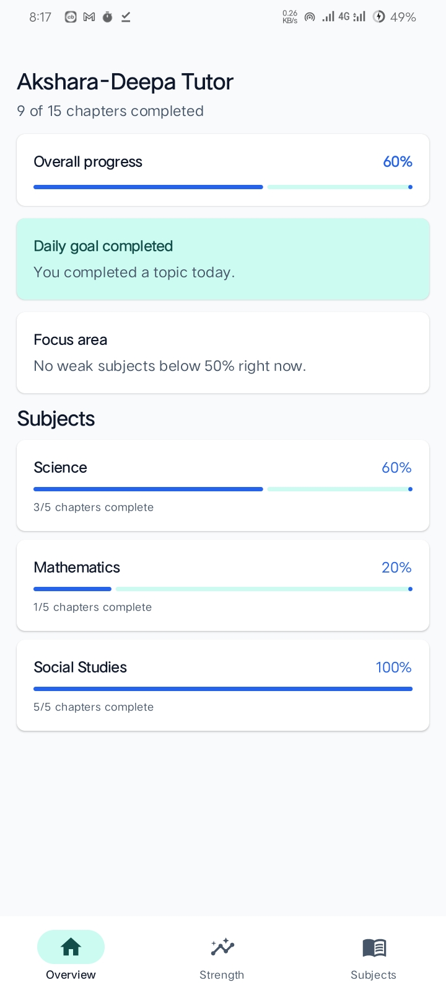
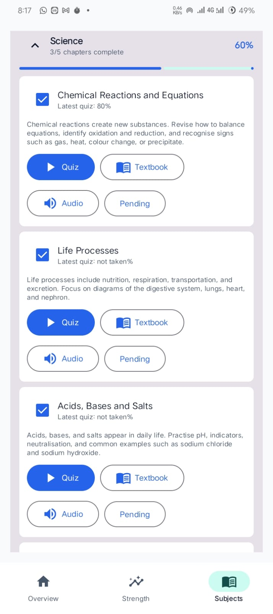
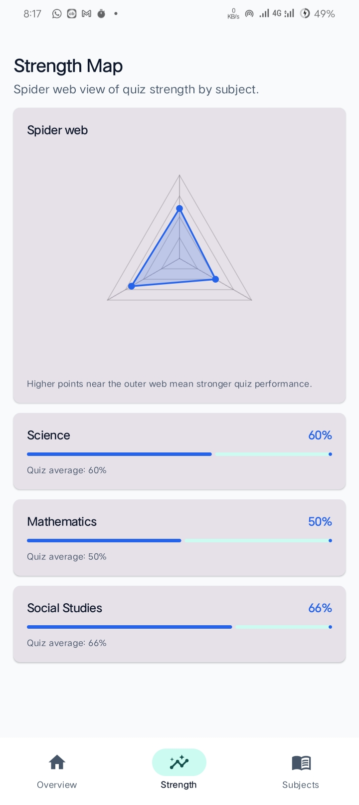
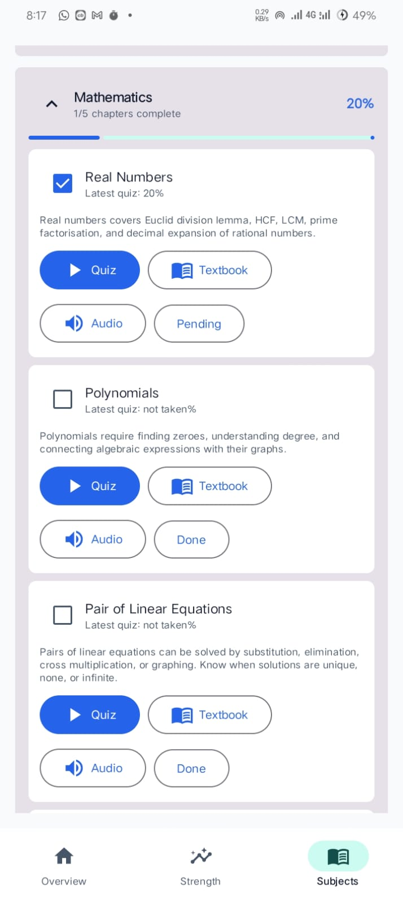
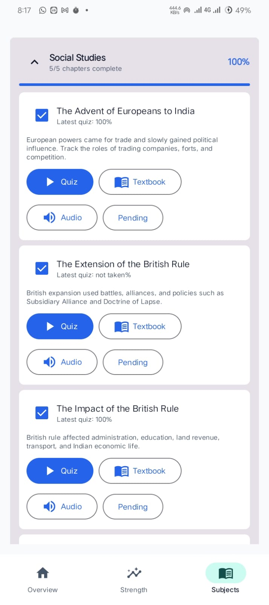
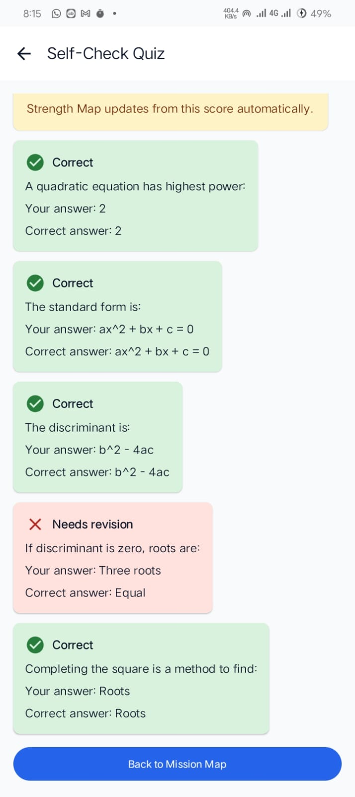

# Akshara-Deepa Tutor

Akshara-Deepa Tutor is an offline-first Android learning app for SSLC self-study. The app helps students track chapter progress, revise textbook lessons, play short audio summaries, take self-check quizzes, and understand subject strength through a visual strength map.

## Problem Statement

SSLC students often study from multiple books, notes, and quiz sources without a simple way to track what they have completed and which subjects need more attention. Akshara-Deepa Tutor brings lessons, progress tracking, quizzes, and revision feedback into one mobile app so students can revise in a more organized way.

## Features

- Dashboard with overall chapter completion and daily goal status.
- Subject-wise progress tracking for Science, Mathematics, and Social Studies.
- Chapter cards with completion status, quiz access, textbook access, and audio revision.
- Offline textbook PDF assets bundled with the app.
- Self-check quiz flow with correct and revision-needed feedback.
- Strength map showing quiz performance by subject.
- Local Room database for subjects, chapters, quiz attempts, and progress.
- DataStore-based settings and daily learning state.

## Tech Stack

- Kotlin
- Android Jetpack Compose
- Material 3
- Room Database
- DataStore Preferences
- Navigation Compose
- Gradle Kotlin DSL

## Screenshots

| Overview | Subjects | Strength Map |
| --- | --- | --- |
|  |  |  |

| Mathematics Chapters | Social Studies Chapters | Quiz Result |
| --- | --- | --- |
|  |  |  |

## Project Structure

```text
Akshara/
├── app/
│   ├── src/main/java/com/aksharadeepa/tutor/
│   │   ├── data/                 # Room database, DAO, repositories, sample data
│   │   ├── domain/               # Progress and domain models
│   │   ├── presentation/         # Compose screens, navigation, theme, utilities
│   │   ├── reminder/             # Daily goal reminder receiver
│   │   ├── AppContainer.kt       # App-level dependency container
│   │   ├── MainActivity.kt       # Main Android activity
│   │   └── TutorApplication.kt   # Application class
│   ├── src/main/assets/lessons/  # Offline lesson PDFs
│   └── build.gradle.kts          # Android app Gradle configuration
├── gradle/wrapper/               # Gradle wrapper files
├── build.gradle.kts              # Root Gradle configuration
├── settings.gradle.kts           # Gradle project settings
└── README.md
```

## Requirements

- Android Studio
- JDK 17
- Android SDK 35
- Gradle wrapper included in the repository

## Setup and Run

Clone the repository:

```powershell
git clone https://github.com/MUSHARAFBAIG124/Akshara.git
cd Akshara
```

Build the debug APK:

```powershell
.\gradlew.bat :app:assembleDebug
```

The debug APK is generated at:

```text
app/build/outputs/apk/debug/app-debug.apk
```

You can also open the project in Android Studio and run the `app` configuration on an emulator or Android device.

## Notes

- The project requires Java 17. If the build uses Java 11 or older, update `JAVA_HOME` or select Android Studio's bundled JDK.
- Generated folders such as `.gradle`, `.kotlin`, `build`, and `app/build` are ignored and should not be committed.
- `local.properties` is machine-specific and should not be pushed to GitHub.

## Future Improvements

- Add more quiz questions for each chapter.
- Add detailed analytics for weak topics.
- Add reminders with configurable study times.
- Add more textbook chapters and audio summaries.
- Add UI tests for major student workflows.
